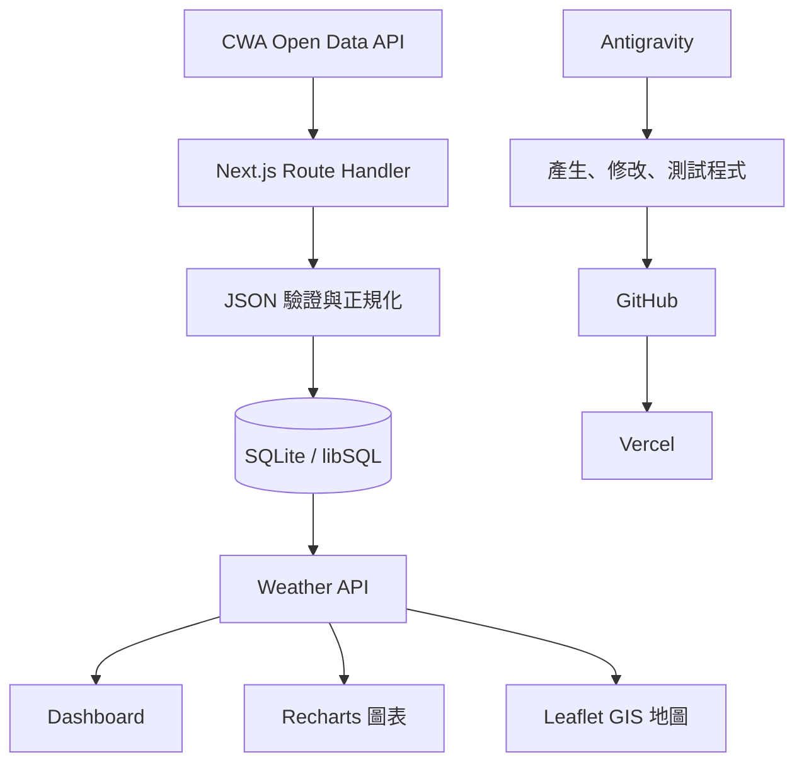

# AI Vibe Coding：台灣天氣預報 GIS 專案完整教學

> 工具：Google Antigravity、GitHub、SQLite/libSQL、中央氣象署 Open Data、Leaflet GIS、Vercel  
> 建議技術：Next.js（App Router）＋ TypeScript ＋ Tailwind CSS ＋ React Leaflet ＋ Recharts ＋ `@libsql/client`

## 0. 專案成果與學習目標

完成後，網站可做到：

1. 從中央氣象署（CWA）Open Data API 讀取臺灣各縣市 36 小時預報。
2. 解析 JSON，整理天氣、降雨機率、最低溫、最高溫與舒適度。
3. 開發環境寫入本機 SQLite；Vercel 正式環境使用 SQLite 相容的 libSQL/Turso。
4. 使用下拉選單切換縣市。
5. 顯示目前摘要卡、溫度折線圖與預報表格。
6. 使用 Leaflet 在臺灣地圖上呈現各縣市天氣。
7. 透過 GitHub 做版本管理，最後部署到 Vercel。
8. 使用 Antigravity 的 Agent、Editor、Terminal 與 Browser 完成「規劃→寫程式→測試→修正」的 Vibe Coding 循環。

本專案的「AI」主要指 AI 輔助軟體開發，不代表用機器學習自行預測天氣。預報數值仍以 CWA 官方資料為準。

---

## 1. 對照老師海報的 24 步驟

| 海報階段 | 本專案做法 |
|---|---|
| 1–3 課程、天氣、CWA | 定義成果並申請 CWA API Key |
| 4–7 API、JSON、整理預覽 | Next.js Server Route 呼叫 API，以 TypeScript 正規化資料 |
| 8–10 SQLite、資料表、SQL | 建立 `forecasts`，用 UPSERT 避免重複資料 |
| 11–16 Web App、查詢、選單、圖表、表格 | Next.js Dashboard、縣市選單、Recharts、表格 |
| 17–19 GIS、日期、完整成果 | Leaflet 臺灣地圖、日期篩選、Popup |
| 20 品質優化 | 型別、錯誤處理、載入狀態、API Key 保護、測試 |
| 21 GitHub | Repository、commit、push、README |
| 22–24 延伸與回顧 | Vercel、定時更新、AI 摘要、災防資料延伸 |

---

## 2. 系統架構



重要設計：瀏覽器不直接呼叫 CWA。API Key 僅存在 Next.js 伺服器端環境變數，避免洩漏。

---

## 3. 前置準備

### 3.1 安裝

- Node.js LTS
- Git
- Google Antigravity IDE
- GitHub 帳號
- Vercel 帳號
- CWA Open Data 帳號與 API Key
- 選配：DB Browser for SQLite

檢查版本：

```bash
node -v
npm -v
git --version
```

### 3.2 CWA 資料集

本教學使用一般天氣預報資料集：

```text
F-C0032-001
```

API 形式：

```text
https://opendata.cwa.gov.tw/api/v1/rest/datastore/F-C0032-001
```

不要把 `Authorization` 金鑰寫入程式碼、README、Git commit 或前端 `NEXT_PUBLIC_*` 變數。

### 3.3 建立專案目錄

在 Antigravity 開啟空白資料夾，於 Terminal 執行：

```bash
npx create-next-app@latest taiwan-weather-ai
cd taiwan-weather-ai
npm install @libsql/client leaflet react-leaflet recharts zod
npm install -D @types/leaflet
```

建立 `.env.local`：

```dotenv
CWA_API_KEY=請貼上新申請的金鑰
DATABASE_URL=file:weather.db
DATABASE_AUTH_TOKEN=
```

確認 `.gitignore` 至少包含：

```gitignore
.env*
!.env.example
*.db
*.db-shm
*.db-wal
```

建立可提交的 `.env.example`：

```dotenv
CWA_API_KEY=
DATABASE_URL=file:weather.db
DATABASE_AUTH_TOKEN=
```

---

## 4. 在 Antigravity 的正確 Vibe Coding 流程

不要一次只說「幫我做天氣網站」。將工作切成可驗收任務：

1. 先要求 Agent 閱讀需求並產生 implementation plan。
2. 審查架構、檔案清單、資料流和風險。
3. 一次完成一個里程碑。
4. 每個里程碑都要求執行 lint、build 與瀏覽器測試。
5. 看 Agent 產出的差異、截圖與測試結果，再接受或要求修正。
6. 每完成一個穩定階段就 Git commit。

### 第一段提示詞：規劃

```text
你是資深全端工程師。請先不要寫程式，先分析並規劃一個「台灣天氣預報 GIS Dashboard」。

技術限制：
- Next.js App Router + TypeScript + Tailwind CSS
- CWA Open Data F-C0032-001
- CWA API Key 只能在伺服器端使用
- 本機使用 SQLite，部署使用 SQLite-compatible libSQL/Turso
- @libsql/client
- React Leaflet 呈現台灣縣市位置
- Recharts 呈現 MinT/MaxT
- GitHub 版本管理，Vercel 部署

功能：
1. 取得、解析、驗證並儲存 CWA 36 小時資料
2. 縣市選單、天氣摘要卡、折線圖、表格、台灣地圖
3. API/DB 失敗要有中文錯誤畫面
4. 響應式設計
5. 不可將 API Key 傳到瀏覽器

請輸出：架構、資料流、資料表 schema、路由、元件、環境變數、里程碑、測試清單與風險。等我確認後再實作。
```

### 第二段提示詞：建立骨架

```text
依已確認的計畫完成里程碑 1：
- 建立資料夾與型別
- 建立 libSQL/SQLite 連線
- 建立 forecasts schema 與初始化函式
- 建立 CWA client、Zod 驗證、normalize 函式
- 建立 /api/weather 與 /api/sync
- 補上 .env.example

完成後請執行 npm run lint 與 npm run build。不要假造測試成功；若失敗請修到通過，並列出修改檔案。
```

### 第三段提示詞：前端與 GIS

```text
完成里程碑 2：建立繁體中文天氣 Dashboard。
- 頁首顯示資料來源與最後更新時間
- 縣市下拉選單
- 天氣、降雨機率、最低溫、最高溫四張卡片
- Recharts MinT/MaxT 折線圖
- 預報資料表
- React Leaflet 台灣地圖與縣市 marker；顏色依溫度分級
- Leaflet 僅在 client side 載入，避免 window is not defined
- 手機、平板、桌機響應式

完成後用 Browser 啟動網站，實際測試切換縣市、圖表、地圖 popup、錯誤狀態，提供測試證據並修正問題。
```

### 第四段提示詞：品質與部署

```text
執行正式部署前檢查：
1. 搜尋是否有 API Key、token、.env 或 weather.db 被提交
2. 執行 lint、build
3. 測試 CWA 失敗、資料庫空白、未知縣市與網路逾時
4. 補 README：架構、安裝、環境變數、操作、資料來源、Vercel/Turso 部署
5. 確認 Route Handler 使用 Node.js runtime
6. 確認 production 不會寫入 Vercel 本機 SQLite
7. 輸出部署檢查清單
```

---

## 5. 建議目錄結構

```text
taiwan-weather-ai/
├─ app/
│  ├─ api/
│  │  ├─ sync/route.ts
│  │  └─ weather/route.ts
│  ├─ globals.css
│  ├─ layout.tsx
│  └─ page.tsx
├─ components/
│  ├─ Dashboard.tsx
│  ├─ ForecastChart.tsx
│  ├─ ForecastTable.tsx
│  ├─ SummaryCards.tsx
│  └─ WeatherMap.tsx
├─ lib/
│  ├─ cwa.ts
│  ├─ db.ts
│  ├─ locations.ts
│  ├─ repository.ts
│  └─ types.ts
├─ public/
├─ .env.example
├─ .gitignore
└─ README.md
```

---

## 6. 資料庫設計

### 6.1 資料表

```sql
CREATE TABLE IF NOT EXISTS forecasts (
  id INTEGER PRIMARY KEY AUTOINCREMENT,
  location_name TEXT NOT NULL,
  start_time TEXT NOT NULL,
  end_time TEXT NOT NULL,
  weather TEXT,
  weather_code TEXT,
  pop INTEGER,
  min_t REAL,
  max_t REAL,
  comfort TEXT,
  fetched_at TEXT NOT NULL,
  UNIQUE(location_name, start_time, end_time)
);

CREATE INDEX IF NOT EXISTS idx_forecasts_location_start
ON forecasts(location_name, start_time);
```

`UNIQUE` 搭配 UPSERT，可避免每次同步都新增一批重複資料。

### 6.2 `lib/db.ts`

```ts
import { createClient } from "@libsql/client";

const url = process.env.DATABASE_URL;
if (!url) throw new Error("缺少 DATABASE_URL");

export const db = createClient({
  url,
  authToken: process.env.DATABASE_AUTH_TOKEN || undefined,
});

export async function initDb() {
  await db.executeMultiple(`
    CREATE TABLE IF NOT EXISTS forecasts (
      id INTEGER PRIMARY KEY AUTOINCREMENT,
      location_name TEXT NOT NULL,
      start_time TEXT NOT NULL,
      end_time TEXT NOT NULL,
      weather TEXT,
      weather_code TEXT,
      pop INTEGER,
      min_t REAL,
      max_t REAL,
      comfort TEXT,
      fetched_at TEXT NOT NULL,
      UNIQUE(location_name, start_time, end_time)
    );
    CREATE INDEX IF NOT EXISTS idx_forecasts_location_start
    ON forecasts(location_name, start_time);
  `);
}
```

---

## 7. CWA API 取得與 JSON 解析

### 7.1 先用瀏覽器或 API 工具觀察 JSON

請只在個人電腦測試，不要把完整含金鑰 URL 截圖或提交：

```text
GET https://opendata.cwa.gov.tw/api/v1/rest/datastore/F-C0032-001
Query:
  Authorization = API Key
  format = JSON
```

重點階層通常為：

```text
records
└─ location[]
   ├─ locationName
   └─ weatherElement[]
      ├─ elementName: Wx / PoP / MinT / MaxT / CI
      └─ time[]
         ├─ startTime
         ├─ endTime
         └─ parameter.parameterName
```

### 7.2 型別

```ts
export type Forecast = {
  locationName: string;
  startTime: string;
  endTime: string;
  weather: string | null;
  weatherCode: string | null;
  pop: number | null;
  minT: number | null;
  maxT: number | null;
  comfort: string | null;
  fetchedAt: string;
};
```

### 7.3 取得資料

```ts
const CWA_URL =
  "https://opendata.cwa.gov.tw/api/v1/rest/datastore/F-C0032-001";

export async function fetchCwaWeather() {
  const apiKey = process.env.CWA_API_KEY;
  if (!apiKey) throw new Error("缺少 CWA_API_KEY");

  const url = new URL(CWA_URL);
  url.searchParams.set("Authorization", apiKey);
  url.searchParams.set("format", "JSON");

  const response = await fetch(url, {
    cache: "no-store",
    signal: AbortSignal.timeout(10_000),
  });

  if (!response.ok) {
    throw new Error(`CWA API 錯誤：${response.status}`);
  }

  return response.json();
}
```

實作時要用 Zod 驗證外部資料，不要把 `any` 一路傳進 UI。若 CWA 調整欄位，錯誤訊息才會清楚。

### 7.4 正規化演算法

對每個 `location`：

1. 將 `weatherElement` 轉成 `{ Wx, PoP, MinT, MaxT, CI }` 查詢表。
2. 以 `Wx.time` 的 `startTime + endTime` 為一筆預報的主時間鍵。
3. 用相同時間索引讀取 PoP、MinT、MaxT、CI。
4. 字串轉成 `number | null`。
5. 加上 `fetchedAt = new Date().toISOString()`。
6. 寫入資料庫時使用 UPSERT。

UPSERT：

```sql
INSERT INTO forecasts (
  location_name, start_time, end_time, weather, weather_code,
  pop, min_t, max_t, comfort, fetched_at
) VALUES (?, ?, ?, ?, ?, ?, ?, ?, ?, ?)
ON CONFLICT(location_name, start_time, end_time)
DO UPDATE SET
  weather = excluded.weather,
  weather_code = excluded.weather_code,
  pop = excluded.pop,
  min_t = excluded.min_t,
  max_t = excluded.max_t,
  comfort = excluded.comfort,
  fetched_at = excluded.fetched_at;
```

---

## 8. API 路由設計

| 方法與路由 | 功能 |
|---|---|
| `POST /api/sync` | 從 CWA 抓資料、驗證、UPSERT |
| `GET /api/weather` | 查全部縣市的最新預報 |
| `GET /api/weather?location=臺中市` | 查單一縣市 |

Route Handler 開頭加入：

```ts
export const runtime = "nodejs";
export const dynamic = "force-dynamic";
```

回應格式統一：

```json
{
  "ok": true,
  "data": [],
  "updatedAt": "2026-09-22T06:30:00.000Z"
}
```

錯誤格式：

```json
{
  "ok": false,
  "error": "暫時無法取得氣象資料"
}
```

不要把原始例外、SQL、Token 或完整 CWA URL 回傳給前端。

### 同步安全

公開網站不應讓任何人無限制觸發 `/api/sync`。可增加：

```dotenv
SYNC_SECRET=自行產生的長隨機字串
```

要求請求 Header：

```text
Authorization: Bearer <SYNC_SECRET>
```

若只是課堂 Demo，也可在 `GET /api/weather` 發現資料過期時由伺服器自動更新，但要限制更新頻率，避免每位訪客都呼叫 CWA。

---

## 9. Dashboard 介面

### 9.1 頁面區塊

1. Header：專案名稱、資料來源、更新時間。
2. Control Bar：縣市與日期選單、重新整理。
3. Summary Cards：天氣、PoP、MinT、MaxT。
4. Chart：X 軸為時段、兩條線為 MinT 與 MaxT。
5. Map：臺灣中心點約 `[23.7, 121]`，初始縮放 `7`。
6. Table：開始、結束、天氣、降雨、低溫、高溫、舒適度。

### 9.2 溫度顏色

| 溫度 | 顏色 |
|---|---|
| `< 20°C` | 藍色 |
| `20–24°C` | 綠色 |
| `25–29°C` | 橘色 |
| `≥ 30°C` | 紅色 |

### 9.3 Leaflet 注意事項

Leaflet 依賴瀏覽器的 `window`，Next.js 必須用 client component，並以 dynamic import 關閉 SSR：

```ts
import dynamic from "next/dynamic";

const WeatherMap = dynamic(() => import("@/components/WeatherMap"), {
  ssr: false,
  loading: () => <div className="h-[520px] animate-pulse rounded-2xl bg-slate-100" />,
});
```

在 `app/layout.tsx` 或全域 CSS 載入：

```ts
import "leaflet/dist/leaflet.css";
```

可先用 22 縣市代表點；進階版再加入政府開放資料的縣市界線 GeoJSON，以 polygon 呈現完整行政區域。

---

## 10. 本機執行與驗收

啟動：

```bash
npm run dev
```

開啟：

```text
http://localhost:3000
```

基本測試：

```bash
npm run lint
npm run build
```

### 驗收表

- [ ] 首次執行能建立 `weather.db`
- [ ] 可成功同步 CWA 資料
- [ ] 22 縣市選單正常
- [ ] 切換縣市後卡片、圖表、表格同步改變
- [ ] 地圖 marker 與 popup 正常
- [ ] 手機寬度不產生水平捲軸
- [ ] CWA 失敗時顯示中文提示
- [ ] 資料庫空白時顯示空狀態
- [ ] 重複同步後資料筆數不會無限制增加
- [ ] `npm run lint` 通過
- [ ] `npm run build` 通過
- [ ] 瀏覽器 Network 看不到 CWA API Key
- [ ] GitHub 找不到 `.env.local` 與 `.db`

### SQLite 查詢練習

```sql
SELECT COUNT(*) FROM forecasts;

SELECT location_name, start_time, min_t, max_t
FROM forecasts
WHERE location_name = '臺中市'
ORDER BY start_time;

SELECT location_name, MAX(max_t) AS hottest
FROM forecasts
GROUP BY location_name
ORDER BY hottest DESC;
```

---

## 11. GitHub 版本管理

先在 GitHub 建立空白 repository，例如 `taiwan-weather-ai`，不要勾選自動建立 README，以免第一次 push 衝突。

```bash
git init
git add .
git status
git commit -m "feat: initialize Taiwan weather dashboard"
git branch -M main
git remote add origin https://github.com/你的帳號/taiwan-weather-ai.git
git push -u origin main
```

建議 commit 節奏：

```text
chore: initialize Next.js project
feat: add CWA weather client and validation
feat: add SQLite forecast repository
feat: add weather API routes
feat: add dashboard chart and table
feat: add Taiwan GIS map
test: add API and normalization tests
docs: add setup and deployment guide
```

上傳前必做：

```bash
git status
git ls-files | grep -E '(\.env|\.db$)'
```

第二個指令理想上不應列出 `.env.local` 或資料庫檔。

---

## 12. Vercel 與 SQLite 的關鍵差異

本機 `file:weather.db` 很適合教學，但不能把 Vercel Function 的本機檔案當永久資料庫。Serverless/雲端執行個體可能重建、切換或有暫存檔案系統，寫入內容無法作為可靠的長期狀態。

因此採雙模式：

| 環境 | `DATABASE_URL` | 用途 |
|---|---|---|
| 本機 | `file:weather.db` | 學習 SQLite、離線開發 |
| Vercel | `libsql://...` | SQLite 相容的持久化雲端資料庫 |

### 12.1 建立 Turso/libSQL

1. 註冊 Turso。
2. 建立資料庫，例如 `taiwan-weather`。
3. 取得 Database URL 與 Auth Token。
4. 不要把它們寫入 repository。

### 12.2 Vercel 部署

1. 登入 Vercel。
2. Add New → Project。
3. Import GitHub repository。
4. Framework 選 Next.js。
5. 設定 Environment Variables：

```text
CWA_API_KEY
DATABASE_URL
DATABASE_AUTH_TOKEN
SYNC_SECRET
```

6. Deploy。
7. 開啟正式網址，測試 API、選單、圖表與地圖。
8. 查看 Vercel Logs，確認沒有暴露密鑰或原始 SQL 錯誤。

### 12.3 定時更新

可用 Vercel Cron 定時呼叫受保護的同步路由，或由資料過期策略在第一位訪客到來時更新。課程專案建議每 30–60 分鐘同步一次，不要毫無限制地輪詢 CWA。

---

## 13. 常見錯誤與修正

| 問題 | 原因 | 修正 |
|---|---|---|
| `401 Unauthorized` | CWA Key 無效或格式錯誤 | 重新產生 Key，檢查 Vercel env，重新部署 |
| `window is not defined` | Leaflet 在伺服器端載入 | client component＋dynamic import `ssr:false` |
| 地圖空白 | 容器沒有高度或 CSS 未載入 | 設定固定/min height，載入 Leaflet CSS |
| 圖表寬度為 0 | 父層無尺寸 | 使用 `ResponsiveContainer`，父層指定高度 |
| Vercel 有畫面但 DB 寫不進去 | 使用本機 SQLite 檔案 | Production 改用 libSQL/Turso |
| 每次同步資料變多 | 沒有 UNIQUE/UPSERT | 建唯一鍵並採 ON CONFLICT UPDATE |
| GitHub 出現 API Key | 金鑰硬編碼或 `.env` 被追蹤 | 立即撤銷/輪替金鑰，再清理 Git 歷史 |
| CWA 欄位讀不到 | JSON 階層或資料集版本不同 | 保存不含密鑰的 sample JSON，更新 Zod schema/normalizer |
| 臺/台名稱對不上 | 資料命名不一致 | 建立名稱正規化表，內部統一使用 CWA 名稱 |

---

## 14. 資安與資料品質

1. CWA Key、DB Token、同步密碼全部放伺服器端環境變數。
2. 不要使用 `NEXT_PUBLIC_CWA_API_KEY`。
3. 限制 `/api/sync`，並設定逾時與更新頻率。
4. 對 `location` query 做白名單驗證，不直接組 SQL。
5. 一律使用參數化 SQL。
6. 用 Zod 驗證 CWA 回傳資料。
7. UI 顯示「資料來源、預報時段、最後擷取時間」。
8. 天氣資訊僅供一般參考；災害資訊應連結官方警特報。
9. 公開前執行 secret scan，若金鑰曾貼在公開處就輪替，不要只刪除文字。

---

## 15. 課堂展示腳本（約 5 分鐘）

1. **問題（30 秒）**：CWA 資料很多，但一般使用者需要快速看懂地區、時段與溫度。
2. **架構（45 秒）**：說明 CWA → API → 驗證 → SQLite/libSQL → Dashboard/GIS。
3. **Vibe Coding（45 秒）**：展示 Antigravity 如何規劃、產生程式、執行測試與以 Browser 驗證。
4. **Demo（2 分鐘）**：切換臺中市/其他縣市、看卡片、折線圖、表格與地圖 popup。
5. **資料庫（30 秒）**：展示 SQLite 查詢與 UPSERT 防重複。
6. **部署（30 秒）**：展示 GitHub commit 與 Vercel 網址。
7. **限制與未來（30 秒）**：目前是官方預報視覺化，未來加入警特報、雷達、空氣品質或 AI 摘要。

---

## 16. 分級成果

### 基礎版

- CWA API
- SQLite
- 縣市下拉選單
- 卡片、圖表、表格
- GitHub

### 完整版

- Leaflet GIS
- 22 縣市
- 錯誤/空白/載入狀態
- Vercel＋libSQL
- 響應式設計
- 自動同步

### 進階版

- 鄉鎮級預報
- 縣市 GeoJSON 分色圖
- 警特報、雨量、雷達或空氣品質圖層
- PWA/手機定位
- 歷史資料統計
- LLM 產生「今日一句話摘要」，但必須以結構化預報資料為依據並標示生成內容

---

## 17. 完成定義（Definition of Done）

專案只有同時符合以下條件才算完成：

- 功能：卡片、圖表、表格、GIS 地圖均可用。
- 資料：資料來自 CWA，時段與更新時間清楚。
- 資料庫：本機 SQLite 可查詢；正式環境可持久化。
- 品質：lint、build、主要互動測試通過。
- 資安：前端與 GitHub 均無密鑰。
- 版本：GitHub commit 清楚，README 能讓同學重現。
- 部署：Vercel 網址可從手機與電腦正常開啟。
- 說明：能區分「AI 輔助寫程式」與「AI 自行預測天氣」。

---

## 18. 官方參考資料

- CWA Open Data 開發指南：https://opendata.cwa.gov.tw/devManual/insrtuction
- Google Antigravity 文件：https://antigravity.google/docs
- Next.js Route Handlers：https://nextjs.org/docs/app/getting-started/route-handlers
- Next.js Environment Variables：https://nextjs.org/docs/app/guides/environment-variables
- Leaflet：https://leafletjs.com/
- Leaflet GeoJSON：https://leafletjs.com/examples/geojson/
- SQLite：https://sqlite.org/
- Vercel Storage：https://vercel.com/docs/storage
- Turso/libSQL：https://turso.tech/

