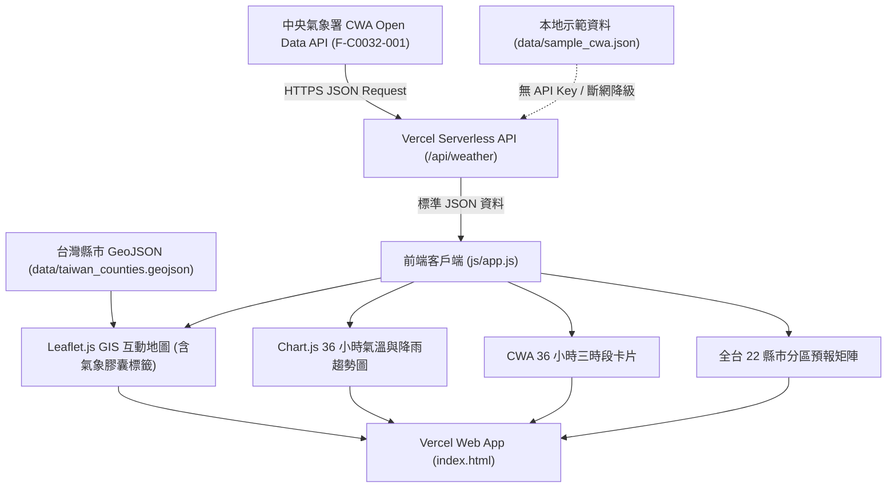

# Taiwan Weather Forecast 台灣氣象預報 GIS 網頁儀表板 (Vercel 版)

> **中央氣象署 CWA Open Data × Leaflet GIS × Chart.js × Vercel Serverless × Python & SQLite**
> 本專案為「AI 創新微課程」實作專案，提供全台灣 22 縣市之即時氣象預報、GIS 空間地理視覺化、36 小時氣溫與降雨機率趨勢圖，原生支援 **Vercel 一鍵無伺服器 (Serverless) 部署**。

---

## 目錄
1. [專案介紹](#1-專案介紹)
2. [系統架構](#2-系統架構)
3. [資料工作流程 (Workflow)](#3-資料工作流程-workflow)
4. [使用技術](#4-使用技術)
5. [CWA 氣象預報資料集說明](#5-cwa-氣象預報資料集說明)
6. [專案目錄結構](#6-專案目錄結構)
7. [Vercel 一鍵部署步驟](#7-vercel-一鍵部署步驟)
8. [本機啟動與開發 (Local Running)](#8-本機啟動與開發-local-running)
9. [建立與設定 .env 環境變數](#9-建立與設定-env-環境變數)
10. [SQLite 資料庫工具與單元測試](#10-sqlite-資料庫工具與單元測試)
11. [常見錯誤排除 (Troubleshooting)](#11-常見錯誤排除-troubleshooting)
12. [API Key 安全規範說明](#12-api-key-安全規範說明)
13. [GeoJSON 資料來源與授權聲明](#13-geojson-資料來源與授權聲明)
14. [系統畫面功能展示](#14-系統畫面功能展示)
15. [GitHub 協作與提交說明](#15-github-協作與提交說明)

---

## 1. 專案介紹
本系統透過自動化管線向中央氣象署 (CWA) 取得台灣一般天氣預報資料 (`F-C0032-001`)，涵蓋全台 22 縣市之今明 36 小時天氣現象 (Wx)、最高溫 (MaxT)、最低溫 (MinT)、12 小時降雨機率 (PoP) 以及舒適度指數 (CI)。

採用極致輕量、無冷啟動延遲的現代化 Web 架構，整合 **Leaflet.js** 與 **Chart.js**，完美重現中央氣象署全球資訊網 V8 版官方視覺風格。

---

## 2. 系統架構



---

## 3. 資料工作流程 (Workflow)

1. **API 連線請求**：
   Vercel Serverless Function (`api/weather.js`) 讀取環境變數 `CWA_API_KEY`，向 CWA API 發送請求。若無 Key 或連線異常，自動切換至 `data/sample_cwa.json`，系統永不崩潰。
2. **JSON 解析與正規化**：
   將 22 縣市資料解析為標準結構，依「今晚至明晨」、「明日白天」、「明日晚上」對齊時段，並統一「台/臺」行政區名稱。
3. **前端渲染 (CWA V8 風格)**：
   `index.html` 透過 Leaflet.js 在地圖各縣市打上專屬 **氣象膠囊 (Weather Pill)**，連動右側三時段卡片與 Chart.js 趨勢圖。

---

## 4. 使用技術

| 類別 | 使用技術 | 說明 |
| :--- | :--- | :--- |
| **雲端部署** | Vercel | 原生 Serverless 無伺服器架構 |
| **後端 API** | Node.js Serverless Function (`/api/weather`) | 高效能 CWA API 代理與資料清洗 |
| **前端架構** | HTML5 + Vanilla CSS + JavaScript (ES6+) | 輕量高響應、零打包負擔 |
| **GIS 地圖** | Leaflet.js 1.9.4 | 台灣 22 縣市邊界與動態膠囊標籤 |
| **視覺圖表** | Chart.js 4.4.1 | 36 小時溫度曲線與降雨機率長條圖 |
| **圖資格式** | GeoJSON (WGS84 / EPSG:4326) | 台灣縣市精準幾何邊界 |

---

## 5. CWA 氣象預報資料集說明

* **資料集代碼**：`F-C0032-001` (一般天氣預報 - 今明 36 小時天氣預報)
* **涵蓋範圍**：全台 22 個直轄市與縣市
* **主要氣象元素**：
  * `Wx`：天氣現象 (晴、多雲、短暫陣雨、雷陣雨等)
  * `PoP`：12 小時降雨機率 (%)
  * `MinT` / `MaxT`：最低溫 / 最高溫 (°C)
  * `CI`：舒適度指數 (舒適、悶熱、寒冷等)

---

## 6. 專案目錄結構

```text
AIIS_0921_weather_forecast/
├── index.html                  # 網頁主入口 (CWA V8 風格)
├── vercel.json                 # Vercel 部署路由設定
├── package.json                # npm 專案設定檔
├── requirements.txt            # Python 相依套件 (單元測試與 DB 工具)
├── README.md                   # 專案完整說明文件
├── .gitignore                  # Git 排除規則
├── .env.example                # 環境變數範例檔
├── api/
│   └── weather.js              # Vercel Serverless API 端點
├── css/
│   └── style.css               # CWA 經典海洋藍主題與響應式樣式
├── js/
│   └── app.js                  # Leaflet GIS 地圖、Chart.js 與互動邏輯
├── data/
│   ├── sample_cwa.json         # 真實結構示範資料 (無金鑰)
│   ├── taiwan_counties.geojson # 台灣 22 縣市 WGS84 圖資
│   └── weather.db              # SQLite 本機資料庫 (已忽略)
├── scripts/                    # SQLite 與 Python 工具腳本
│   ├── init_db.py
│   ├── fetch_cwa.py
│   ├── check_database.py
│   └── test_cwa_api.py
├── services/                   # Python 資料處理模組
└── tests/                      # Pytest 單元測試
```

---

## 7. Vercel 一鍵部署步驟

1. 將專案 Push 至您的 GitHub 儲存庫：
   `https://github.com/damondtsai/AIIS_0921_weather_forecast.git`
2. 前往 [Vercel Dashboard](https://vercel.com/)，點擊 **"Add New Project"**。
3. 選擇 `AIIS_0921_weather_forecast` 儲存庫並點擊 **Import**。
4. 在 **Environment Variables** 新增環境變數：
   - Key: `CWA_API_KEY`
   - Value: `您的中央氣象署授權碼`
5. 點擊 **Deploy**，約 15 秒即可完成全自動部署！

---

## 8. 本機啟動與開發 (Local Running)

於 Windows PowerShell 執行：

```powershell
# 使用 Node.js 啟動本地伺服器
npx -y serve . -p 3000
```
或使用 Python 內建伺服器：
```powershell
python -m http.server 3000
```

開啟瀏覽器前往：`http://localhost:3000`

---

## 9. 建立與設定 .env 環境變數

```env
CWA_API_KEY=your_actual_cwa_api_key_here
CWA_DATASET_ID=F-C0032-001
```

---

## 10. SQLite 資料庫工具與單元測試

專案完整保留 Python 後端工具與單元測試：

```powershell
# 執行單元測試
python -m pytest -v

# 檢查本機 SQLite 資料庫
python scripts/check_database.py
```

---

## 11. 常見錯誤排除 (Troubleshooting)

1. **地圖顯示正常但為示範資料模式**：
   - 請檢查 Vercel 或本機 `.env` 是否已設定 `CWA_API_KEY`。
2. **本機連接時出現 Port 佔用**：
   - 可改用其他 Port：`npx serve . -p 8080`。

---

## 12. API Key 安全規範說明

* ❌ 絕不在原始碼、前端 JavaScript、JSON 或 GitHub 追蹤檔案寫死 API Key。
* ✅ 本機環境變數透過 `.env` 載入，已加入 `.gitignore`。
* ✅ Vercel 上透過 Serverless Function 在後端呼叫，前端不會暴露金鑰。

---

## 13. GeoJSON 資料來源與授權聲明

* **資料來源**：OpenStreetMap 台灣行政區圖資 / Click That Hood 開源圖資庫。
* **座標系統**：WGS84 (EPSG:4326)。
* **授權條款**：Open Data Commons Open Database License (ODbL)。

---

## 14. 系統畫面功能展示

1. **CWA 官方海洋藍導覽列**：即時時鐘、即時連線徽章、手動更新。
2. **Leaflet 互動 GIS 地圖**：
   - 縣市上方浮動 **氣象膠囊標籤 (Weather Pill)**。
   - 最高溫 / 最低溫 / 降雨機率圖層著色切換與圖例。
3. **今明 36 小時三時段卡片**：「今晚至明晨」、「明日白天」、「明日晚上」。
4. **Chart.js 氣象趨勢圖**：氣溫平滑曲線與降雨率長條圖。
5. **全台 22 縣市分區預報矩陣**：支援北部/中部/南部/東部/離島分頁與關鍵字搜尋。

---

## 15. GitHub 協作與提交說明

* **Repository**: `https://github.com/damondtsai/AIIS_0921_weather_forecast.git`
