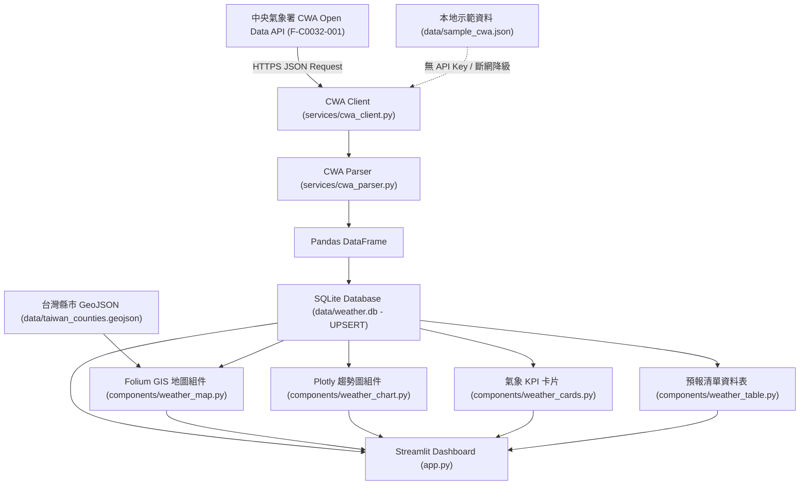

# Taiwan Weather Forecast 台灣氣象預報 GIS 網頁儀表板

> **中央氣象署 CWA Open Data × Python × SQLite × Streamlit × Folium GIS × Plotly**
> 本專案為「AI 創新微課程」實作專案，提供全台灣 22 縣市之即時氣象預報、GIS 空間地理視覺化、36 小時氣溫與降雨機率趨勢圖及歷史預報資料庫管理系統。

---

## 目錄
1. [專案介紹](#1-專案介紹)
2. [系統架構](#2-系統架構)
3. [資料工作流程 (Workflow)](#3-資料工作流程-workflow)
4. [使用技術](#4-使用技術)
5. [CWA 氣象預報資料集說明](#5-cwa-氣象預報資料集說明)
6. [專案目錄結構](#6-專案目錄結構)
7. [安裝 Python](#7-安裝-python)
8. [建立 Virtual Environment](#8-建立-virtual-environment)
9. [安裝相依套件 (Requirements)](#9-安裝相依套件-requirements)
10. [建立與設定 .env 環境變數](#10-建立與設定-env-環境變數)
11. [初始化 SQLite 資料庫](#11-初始化-sqlite-資料庫)
12. [抓取 CWA 氣象資料](#12-抓取-cwa-氣象資料)
13. [啟動 Streamlit 網頁](#13-啟動-streamlit-網頁)
14. [執行單元測試 (Pytest)](#14-執行單元測試-pytest)
15. [常見錯誤排除 (Troubleshooting)](#15-常見錯誤排除-troubleshooting)
16. [API Key 安全規範說明](#16-api-key-安全規範說明)
17. [GeoJSON 資料來源與授權聲明](#17-geojson-資料來源與授權聲明)
18. [系統畫面功能展示](#18-系統畫面功能展示)
19. [未來功能規劃 (Roadmap)](#19-未來功能規劃-roadmap)
20. [GitHub 協作與提交說明](#20-github-協作與提交說明)

---

## 1. 專案介紹
本系統透過自動化管線定期向中央氣象署 (CWA) 取得台灣一般天氣預報資料 (`F-C0032-001`)，涵蓋全台 22 縣市之今明 36 小時天氣現象 (Wx)、最高溫 (MaxT)、最低溫 (MinT)、12 小時降雨機率 (PoP) 以及舒適度指數 (CI)。

資料經過嚴格的清洗、行政區代碼對齊與時區標準化後儲存於本機 SQLite 資料庫，並以 Streamlit 搭配 Folium 與 Plotly 建立現代化、響應式的 GIS 氣象儀表板。

---

## 2. 系統架構



---

## 3. 資料工作流程 (Workflow)

1. **API 連線請求**：
   `services/cwa_client.py` 讀取環境變數 `CWA_API_KEY`，使用 requests 發送 GET 請求 (Timeout 20 秒)。若無 Key 或網路異常，自動降級讀取 `data/sample_cwa.json`，系統維持運作並於前端顯示 `Demo Data` 標記。
2. **JSON 解析與正規化**：
   `services/cwa_parser.py` 依 `elementName` 解析 Wx、PoP、MinT、MaxT、CI，依 `(startTime, endTime)` 精準對齊時段，並呼叫 `location_service.py` 統一「台/臺」縣市全稱與時間轉換為 Asia/Taipei。
3. **資料庫持久化**：
   `services/database.py` 透過參數化 SQL 與複合唯一索引 `(dataset_id, location_name, start_time, end_time)` 執行 UPSERT 寫入 `data/weather.db`。
4. **前端視覺化渲染**：
   `app.py` 呼叫組件層繪製 KPI 卡片、Folium 分級著色 GIS 地圖、Plotly 溫度與降雨趨勢圖，並提供手動更新與快取機制 (TTL 1800s)。

---

## 4. 使用技術

| 類別 | 使用技術 / 套件 | 說明 |
| :--- | :--- | :--- |
| **核心語言** | Python 3.11+ / 3.14 | 專案主要開發語言 |
| **HTTP 請求** | `requests` | API 通訊與 Timeout 處理 |
| **環境變數** | `python-dotenv` | 安全載入 `.env` 金鑰 |
| **資料處理** | `pandas` | 資料轉換、表格清洗與結構化 |
| **資料庫** | `sqlite3` (內建) | 本機關聯式資料庫，支援 UPSERT |
| **網頁框架** | `streamlit` | 響應式互動 Web 應用 |
| **GIS 地圖** | `folium`, `streamlit-folium` | 台灣行政區互動式地圖 |
| **圖表視覺化** | `plotly` | 36 小時溫度與降雨雙 Y 軸互動圖 |
| **單元測試** | `pytest` | 涵蓋 Parser 容錯與 DB 交易測試 |

---

## 5. CWA 氣象預報資料集說明

* **資料集代碼**：`F-C0032-001` (一般天氣預報 - 今明 36 小時天氣預報)
* **涵蓋範圍**：全台 22 個直轄市與縣市
* **主要氣象元素**：
  * `Wx`：天氣現象 (如：晴時多雲、多雲短暫陣雨、午後短暫雷陣雨)
  * `PoP` / `PoP12h`：12 小時降雨機率 (%)
  * `MinT`：最低溫度 (°C)
  * `MaxT`：最高溫度 (°C)
  * `CI`：舒適度指數描述 (如：舒適、悶熱、寒冷)
  * `startTime` / `endTime`：預報時段起始與結束時間

---

## 6. 專案目錄結構

```text
AIIS_0921_weather_forecast/
├── app.py                      # Streamlit 網頁主程式
├── requirements.txt            # Python 相依套件清單
├── README.md                   # 專案繁體中文完整說明文件
├── .gitignore                  # Git 忽略設定 (排除金鑰與 DB)
├── .env.example                # 環境變數範例檔 (僅含假資料)
├── data/
│   ├── sample_cwa.json         # 真實結構之示範資料 (無敏感金鑰)
│   ├── taiwan_counties.geojson # 台灣 22 縣市 WGS84 邊界 GeoJSON
│   └── weather.db              # SQLite 預報資料庫 (本機自動生成)
├── scripts/
│   ├── init_db.py              # 初始化資料表與縣市地理座標種子
│   ├── fetch_cwa.py            # 手動抓取 CWA API 並寫入 SQLite
│   ├── check_database.py       # 檢查資料庫統計與健康狀態
│   ├── prepare_geojson.py      # 下載與校正台灣縣市 GeoJSON
│   └── test_cwa_api.py         # 測試 CWA API 連線狀態 (不印金鑰)
├── services/
│   ├── __init__.py
│   ├── cwa_client.py           # CWA API 連線客戶端與容錯降級
│   ├── cwa_parser.py           # F-C0032-001 JSON 解析器
│   ├── database.py             # SQLite 連線與 UPSERT 邏輯
│   └── location_service.py     # 22 縣市座標、代碼與名稱正規化
├── components/
│   ├── __init__.py
│   ├── weather_cards.py        # 即時天氣 KPI 指標卡片
│   ├── weather_map.py          # Folium 台灣 GIS 互動地圖
│   ├── weather_chart.py        # Plotly 氣溫與降雨趨勢圖
│   └── weather_table.py        # 格式化完整預報資料表
└── tests/
    ├── test_cwa_parser.py      # Parser 容錯與邊界條件測試
    └── test_database.py        # 資料庫 CRUD、UPSERT 與 Rollback 測試
```

---

## 7. 安裝 Python

請確保系統已安裝 Python 3.11 或以上版本（支援 Python 3.13 / 3.14）：

```powershell
python --version
# 或
py -0
```

---

## 8. 建立 Virtual Environment

建議在專案目錄下建立獨立的虛擬環境：

```powershell
py -m venv .venv
.\.venv\Scripts\Activate.ps1
```

> 若遇到 PowerShell 執行原則限制，請在 PowerShell 執行：
> `Set-ExecutionPolicy -ExecutionPolicy RemoteSigned -Scope CurrentUser`

---

## 9. 安裝相依套件 (Requirements)

```powershell
python -m pip install --upgrade pip
python -m pip install -r requirements.txt
```

---

## 10. 建立與設定 .env 環境變數

複製範例環境變數檔為 `.env`：

```powershell
Copy-Item .env.example .env
```

編輯 `.env` 填入您的 CWA API 授權碼：
```env
CWA_API_KEY=your_actual_api_key_here
CWA_DATASET_ID=F-C0032-001
```

> **注意：** 若無 API Key，系統將自動以 `data/sample_cwa.json` 示範模式執行。

---

## 11. 初始化 SQLite 資料庫

執行初始化腳本以建立 `locations` 與 `weather_forecasts` 資料表，並預填 22 縣市地理座標：

```powershell
python scripts/init_db.py
```

---

## 12. 抓取 CWA 氣象資料

執行抓取腳本將最新預報寫入資料庫：

```powershell
python scripts/fetch_cwa.py
```

檢查資料庫健康度：
```powershell
python scripts/check_database.py
```

---

## 13. 啟動 Streamlit 網頁

於 PowerShell 啟動儀表板：

```powershell
streamlit run app.py
```

啟動後瀏覽器會自動開啟 `http://localhost:8501`。

---

## 14. 執行單元測試 (Pytest)

執行完整單元測試以驗證解析器與資料庫運作：

```powershell
python -m pytest -v
```

測試涵蓋：
* 正常/缺失氣象元素 JSON 解析
* 非法數值型態防護
* 元素陣列順序顛倒解析
* 「台／臺」名稱正規化
* SQLite UPSERT 重複防護與資料庫 Rollback 交易機制

---

## 15. 常見錯誤排除 (Troubleshooting)

1. **`ModuleNotFoundError: No module named 'streamlit'`**：
   * 請確認已啟動虛擬環境 (`.\.venv\Scripts\Activate.ps1`) 並安裝 `requirements.txt`。
2. **連線 CWA API 失敗 (HTTP 401 / 403)**：
   * 請檢查 `.env` 中的 `CWA_API_KEY` 是否包含多餘空白或引號。
3. **地圖無法顯示或空白**：
   * 請檢查 `data/taiwan_counties.geojson` 是否存在，可重新執行 `python scripts/prepare_geojson.py`。
4. **時區時間不一致**：
   * 本專案已全域綁定 `Asia/Taipei` (UTC+8) 時區，確保跨平台時間顯示一致。

---

## 16. API Key 安全規範說明

本專案遵守嚴格之資訊安全守則：
* ❌ 絕不在原始碼、JSON 資料、測試程式或文件寫死真實 API Key。
* ❌ 絕不在終端機 Output 或 Log 中印出 API Key。
* ✅ 僅透過 `.env` 讀取 `CWA_API_KEY`。
* ✅ `.gitignore` 已強制排除 `.env`、`data/weather.db` 與 `.streamlit/secrets.toml`。

---

## 17. GeoJSON 資料來源與授權聲明

* **資料來源**：OpenStreetMap 台灣行政區圖資 / Click That Hood 開源圖資庫。
* **座標系統**：WGS84 (EPSG:4326)。
* **授權模式**：Open Data Commons Open Database License (ODbL) 與開放政府資料授權條款。
* **經緯度校正**：中心點經緯度皆經過內政部與氣象署測站座標校對，行政區名稱皆正規化為標準繁體中文。

---

## 18. 系統畫面功能展示

1. **頂部狀態列**：顯示 CWA Live 即時連線狀態或 Demo 模式徽章。
2. **氣象概況 KPI 卡片**：天氣現象圖示、最高氣溫、最低氣溫、12小時降雨機率、舒適度描述。
3. **互動式 GIS 氣象地圖**：
   * 指標切換（最高溫 / 最低溫 / 降雨機率）
   * 分級著色（高溫紅、溫暖橙、舒適綠、偏涼藍；降雨深淺藍紫）
   * 點擊縣市彈出完整預報 Popup 與選中醒目圓點
4. **Plotly 趨勢圖**：雙軸展示 36 小時氣溫與降雨機率變化。
5. **完整資料表**：支援全台 22 縣市即時預報排序與檢視。

---

## 19. 未來功能規劃 (Roadmap)

* [ ] 整合 CWA 一週天氣預報 (`F-D0047-091`)。
* [ ] 增加全台即時雷達回波圖與定量降水預報 (QPF) 圖層。
* [ ] 整合中央氣象署紫外線 (UV) 指數與空氣品質 (AQI) 指標。
* [ ] 提供 Telegram / LINE Notify 氣象警報推播整合。

---

## 20. GitHub 協作與提交說明

* **Repository**: `https://github.com/damondtsai/AIIS_0921_weather_forecast.git`

標準 PowerShell 指令：
```powershell
# 1. 檢查狀態 (確認無 .env 與 weather.db 遭追蹤)
git status

# 2. 加入追蹤檔案
git add .

# 3. 提交變更
git commit -m "feat: complete Taiwan Weather Forecast GIS Dashboard with CWA API, SQLite, and Folium"

# 4. 推送至遠端 (確認後執行)
git push origin main
```
